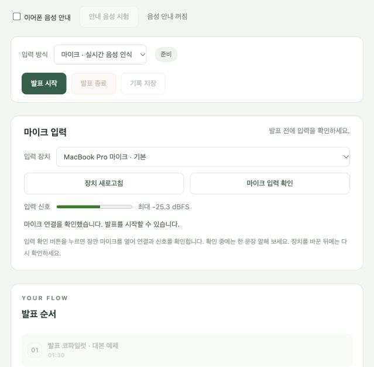

# 마이크 입력 복구 및 발표 중 기능 검수

검수일: 2026-10-05 · 환경: MacBook, 메모리 16GB, macOS, 로컬 SenseVoice STT/Ollama

## 확인한 원인

사용자가 본 `Internal PortAudio error [PaErrorCode -9986]`는 이 환경에서 실제로 재현했다. 당시 macOS 로그는 마이크 접근을 허용한 상태였고, Core Audio는 `mlock failure`와 `failed to lock the buffer`, 오디오 입력 스레드 시작 실패를 기록했다. 실행 중인 `qwen3:14b`는 Ollama 표시 기준 약 9.6GB를 GPU에 올리고 있었다.

같은 입력 장치에서 14B 모델을 내린 직후 입력 스트림이 정상 시작되고 콜백이 수신됐다. 기본 모델을 `qwen3:8b`로 변경했고 약 5.9GB가 메모리에 올라간 상태에서 실제 마이크·STT·LLM 동시 실행을 확인했다. 이는 이 맥에서 관측한 메모리 부하와 오디오 버퍼 실패의 연관이며, 모든 -9986 오류의 원인이 같다는 뜻은 아니다. OS 권한과 보안 설정은 변경하지 않았다.

## 수정 내용

- 마이크 입력 장치 선택, 목록 새로고침, 사용자가 누르는 0.7초 입력 확인, 신호 세기·수신 시간 표시를 추가했다. 페이지를 여는 것만으로 녹음하지 않는다.
- 장치의 기본 입력 주파수를 확인하고 사용한다. 44.1kHz에서도 16kHz 변환 후 VAD 창과 정확히 맞는 버퍼 크기를 사용한다.
- 실제 입력 프레임을 받은 후에만 녹음 상태로 표시한다. 초기 프레임 미수신과 녹음 중 입력 중단은 오류로 표시한다.
- 입력 확인과 녹음은 공통 잠금으로 보호한다. 활성 스트림이 있을 때 PortAudio를 초기화하지 않는다. 선택 장치가 사라지거나 이름이 달라지면 오류로 중단한다.
- 일부 네이티브 스트림 시작 오류는 실패 스트림을 닫은 뒤 같은 장치에서 한 번만 재시도한다. 녹음 도중 자동으로 다른 마이크를 선택하지 않는다.
- 오류 후 사용자가 같은 발표에서 마이크를 다시 연결할 수 있다. 연결 번호마다 원시 로그·구간 ID를 나누고 원래 실패 이력을 보존한다. 입력 손실이 생긴 세션은 속도 판단을 보류할 수 있다.
- 음성 입력 유실·STT 실패·모델 오류가 있으면 대본 누락 후보를 판단불가로 보류하고 기존 누락 안내도 즉시 철회한다. 캡처/STT 품질 문제 자체는 이미 설명된 내용을 유지한다. 모델 요청 실패는 평가 대상의 기존 확인도 판단불가로 낮추고 과거 근거를 이벤트에 보존한다. 이후 유효한 실제 발화 근거로 내용 확인은 계속 진행한다.
- 마이크 오류가 났을 때 직접 전사 입력 모드로 잘못 바뀌던 화면·API 동작을 고쳤다. 오래된 폴링 응답이 새 명령 결과를 덮어쓰지 않게 했다.
- 발표 종료 때 마지막 강제 분할 발화와 빈 flush 꼬리가 남더라도 최종 내용 평가를 처리한 뒤 저장한다.
- 종료한 발표 뒤 새 대본·자료를 준비하면 새 자료를 표시한다. 이전 결과 파일은 유지하고 잘못된 새 자료는 기존 상태를 변경하지 않는다.
- 기본 실행은 설치된 8B 로컬 의미 모델을 사용한다. 모델을 사용하지 않는 등록 표현 기준선은 명시적으로 `--phrase-coach`를 지정한다. 모델을 자동 다운로드하지 않는다.
- 1.5초 이내의 짧은 쉼으로 나뉜 조각을 합쳐 보낼 때, 모델에 보여 주는 근거 번호를 연속 번호로 만들고 실제 모든 원본 구간 ID로 복원한다.
- 모델이 완료로 답해도 명확한 미완성 어미나 대본 수치의 근거 불일치는 판단불가로 보류한다. 이미 확인된 내용을 미완성 후속 발화 하나 때문에 취소하지 않는다. 수치 검사는 지원 단위의 필요 조건이며 의미 판단을 대신하거나 완료를 자동 승인하지 않는다.

## 검증

자동 회귀 검사 결과와 실제 입력 검증 요약은 [검증 JSON](presentation_microphone_validation.json)에 기록한다.

최종 전체 Python 검사 **190개가 130.005초에 통과**했고, 마이크 화면의 장치 선택·중복 입력 확인·오류 모드·연결 해제·재연결 상태를 검증하는 DOM 회귀 검사 **22개가 통과**했다.

로컬 의미 모델 개발 평가는 기존 단일 항목 20개, 다중 항목 8개, 중간 쉼 4개를 합쳐 실행했다. v14 어댑터와 8B 모델의 **32/32 사례, 44/44 항목**이 기대 결과와 일치했고 38회 응답이 모두 유효했다. 모델 요청 p95는 **1,412.15ms**였다. 같은 사례의 보완 전 8B v13은 30/32였으며, 최종 32/32는 수치·미완성 검사까지 포함한 시스템 결과다. 독립 데이터 정확도나 발화 종료부터 화면까지의 지연으로 해석하면 안 된다.

실제 입력 시험은 제공된 한국어 예제 WAV를 현재 시스템 스피커로 재생하고 **맥 내장 마이크로 캡처**했다. 실제 VAD → SenseVoice → 로컬 8B 내용 판단 → 종료·저장 경로를 사용했다. 직접 텍스트를 API에 넣거나 가짜 입력 스트림을 사용한 시험이 아니다. 사람이 말한 발표의 인식 정확도 시험은 아니다.

최종 입력 시험은 5.824초를 캡처해 1개 발화 구간을 처리했다. 대본 첫 구간은 설명됨, 말하지 않은 두 번째 구간은 미확인으로 남았다. 모델 판단 요청은 1,320.55ms였고 입력 손실·오류·품질 문제 없이 종료·저장됐다.

최종 서버의 브라우저에서 내장 마이크를 직접 선택해 **마이크 입력 확인**을 눌렀다. 실제 22개 콜백을 받았고 최대 신호 -25.3dBFS와 연결 성공 안내가 표시됐다. 시험 후 녹음은 종료됐고 서버는 새 발표 준비 상태다.



재현용 개발 데이터는 [32개 통합 사례](../../examples/coaching_microphone_eval.json)에 보관한다.

```bash
.venv/bin/python -m unittest discover -s tests -v
node tests/test_presentation_ui.cjs
.venv/bin/python scripts/evaluate_coaching.py --dataset examples/coaching_microphone_eval.json --ollama-model qwen3:8b --timeout 60 --warm-up
.venv/bin/python scripts/run_presentation.py
```

마지막 명령은 로컬 Ollama와 이미 설치된 `qwen3:8b`가 필요하다. 모델 요청 제한은 기본 6초이며 성능 보장이 아니다.

## 남은 실제 시험

사람의 한국어 발표와 긴 발표에서 인식·누락·속도·이어폰 안내를 함께 검증해야 한다. STT 오인식, 스피커 음성이 마이크에 다시 들어오는 현상, 긴 동시 부하, 사람 기준 화면 지연은 이번 짧은 입력 시험으로 해결됐다고 판단할 수 없다. 지원 단위 밖의 수치와 문장 관계·부정은 의미 모델의 오류 가능성이 남아 있다.

보드 전원선이 손상된 상태여서 보드 성능은 검증하지 않았다. 보드 수리 후 장치 선택·음성 입출력·동시 부하 시험을 별도로 진행해야 한다.
