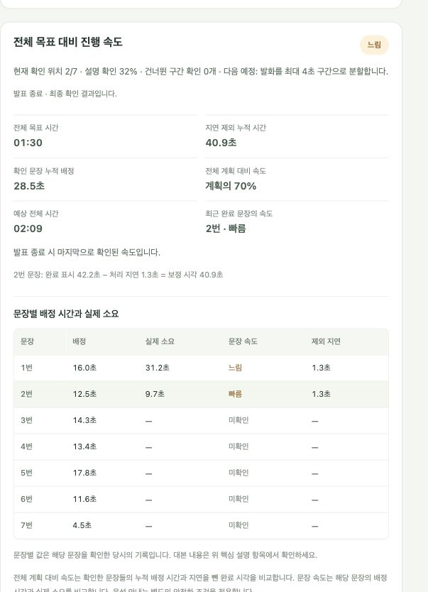

# 문장별 시간 배정과 실시간 화면 속도

작성일: 2026-10-05

대본 완료 판단은 유지하고, 목표 시간을 문장별로 배정한 뒤 실제 발화 시각과 비교하는 화면을 추가했다. 첫 문장을 확인하면 바로 빠름·적당함·느림을 표시하며 다음 발화 처리 중과 발표 종료 후에도 마지막 유효 값을 유지한다. 기존 음성 안내의 최소 관측·안정화·간격 조건은 유지했다.

## 계산 기준

- 문장 배정 시간 = 전체 목표 시간 × 해당 문장의 공백·문장부호 제외 글자 수 ÷ 전체 글자 수.
- 문장 완료 표시 시각 = 최초 설명됨 결과를 적용한 실제 monotonic 경과 시간. 발표 종료 요청 뒤에 처리된 결과도 실제 적용 시각을 기록한다.
- 처리 지연 = 완료 표시 시각 − 근거 발화 종료 시각. STT·판단·대기 시간을 포함하는 시각 차이이며 고정 지연을 가정하지 않는다.
- 보정 완료 시각 = 완료 표시 시각 − 처리 지연.
- 문장 실제 소요 = 해당 보정 완료 시각 − 직전 문장 보정 완료 시각. 첫 문장은 발표 시작부터 계산하고 문장 사이 휴지는 포함한다.
- 문장 속도 = 문장 배정 시간 ÷ 문장 실제 소요.
- 전체 계획 대비 속도 = 확인한 고유 문장들의 누적 배정 시간 ÷ 마지막 확인 문장의 보정 완료 시각.
- 예상 전체 시간 = 마지막 보정 완료 시각 ÷ 확인 대본량 비율.

속도 비율 125% 초과는 빠름, 75% 미만은 느림, 두 경계를 포함한 사이는 적당함이다. 발음 자체의 분당 음절 속도를 판정하는 기능은 아니다. 여러 문장의 지연을 전체 경과 시간에서 합산 차감하지 않아, 말하면서 앞 문장을 처리하는 시간을 중복 제거하지 않는다.

반복 설명은 최초 완료 시각을 바꾸지 않는다. 완료 판단 철회 후 다시 확인하면 새 시각을 기록한다. 앞 문장이 미확인·불확실하거나 입력·판단 오류가 있으면 전체 속도를 보류한다. 한 발화로 여러 문장이 확인되어 인접 완료 시각이 같으면 해당 문장의 개별 속도는 보류한다.

모델이 뒤 문장에 앞 문장보다 오래된 발화 근거를 연결할 수 있다. 이 경우 내용 상태와 원래 근거는 그대로 보존하고, **그 판단 요청에 포함된 마지막 발화 종료 시각**으로 시간만 보정해 `timing_estimated=true`와 **시각 추정**을 표시한다. 결과가 도착하는 동안 더 새로 들어온 발화 시각을 사용하지 않는다. 앞서 빠진 문장을 나중에 확인하는 경우에는 원래 근거 시각을 유지하고 진행 위치를 되감지 않는다.

## 첨부 기록으로 계산 확인

입력은 `presentation_f8d7e9dcecb4430894d3f65b980c33cc.json`의 대본·전사·저장된 내용 판단이다. 물리 마이크와 모델을 재실행하지 않고 제어된 시계로 원래 이벤트 시각을 재생했다. 이 검증은 새 시간 계산과 상태 표시를 확인하며 새 STT·LLM 성능 측정이 아니다. 결과와 입력·소스 해시는 [검증 JSON](presentation_sentence_pacing_validation.json)에 기록했다.

목표 90초인 일곱 문장의 결과:

| 문장 | 배정 | 실제 소요 | 제외 지연 | 문장 속도 |
|---|---:|---:|---:|---|
| 1 | 16.04초 | 11.51초 | 1.64초 | 빠름 |
| 2 | 12.48초 | 4.10초 | 1.72초 | 빠름 |
| 3 | 14.26초 | 5.09초 | 1.87초 | 빠름 |
| 4 | 13.37초 | 5.44초 | 1.95초 | 빠름 |
| 5 | 17.82초 | 5.95초 | 1.90초 | 빠름 |
| 6 | 11.58초 | 10.72초 | 1.87초 | 적당함 · 시각 추정 |
| 7 | 4.46초 | 5.73초 | 2.52초 | 적당함 |

첫 문장은 완료 표시 13.15초에서 실제 지연 1.64초를 빼 11.51초로 계산한다. 여섯째 문장은 모델의 원래 근거 종료 시각이 15.61초라서 이를 그대로 사용하면 약 29초를 처리 지연으로 오인한다. 시간만 해당 요청의 발화 종료 42.81초로 보정했다.

최종 전체 속도는 `90 ÷ 48.53 = 185.4%`로 빠름이다. 최근 문장만의 속도와 전체 누적 속도는 별도 라벨로 표시한다. 저장된 일곱 문장의 내용 상태와 근거는 모두 동일하며, 최초 확인 이후 처리 중 체크포인트 일곱 개에서 화면 속도가 사라지지 않았다. 기존 음성 안내 계산과 억제 정책도 유지된다.

## 구현·검수 범위

`ScriptSession.progress()`의 기존 음성용 필드를 유지하고 화면용 `display_pace`를 추가했다. 각 문장에 배정 시간, 최초 완료 표시 시각, 원래 근거 발화 종료 시각, 처리 지연, 보정 시각, 실제 소요, 속도와 추정 여부를 함께 저장한다. 상태 API와 JSON 내보내기에서 같은 값을 사용한다.

화면에는 전체 목표·지연 제외 누적 시간·확인 문장 누적 배정·전체 계획 대비 속도·예상 전체 시간·최근 문장 속도와 문장별 시간 표를 추가했다. 첫 확인 전 대기, 처리 중 마지막 값, 오류로 인한 보류, 종료 후 최종 결과를 구분한다.

- 문장 시간 검사 22개 및 HTTP 상태·내보내기 검사 2개 통과.
- 화면 DOM 검사 79개 통과.
- Python 전체 회귀 검사 315개 통과(135.31초). 실제 마이크 입력이나 스피커 재생은 수행하지 않았다.
- 저장된 판단 재생에서 내용 상태·근거 불변, 처리 중 표시 유지, 종료 결과 유지 확인.
- 독립 검수에서 과거 근거 보정·앞 문장 보충·반복·판단 철회·종료 중 적용 시각 경계 재확인.

화면 문법 검사와 변경 공백 검사도 통과했다. 브라우저에서는 실제 로컬 `qwen3:8b`에 두 문장을 직접 전사 입력하여 첫 문장 확인 직후 표시, 두 번째 문장 처리 중 유지, 종료 후 최종 결과를 확인했다. 이 시험도 물리 마이크나 음성 출력을 사용하지 않았다. 검수 후 사용자의 일곱 문장·목표 90초를 발표 준비 상태로 복원했으며 음성 안내는 꺼져 있다.

## 남은 실제 통합 확인

사용자가 마이크로 문장을 읽으면서 새로운 문장 완료와 화면 속도 변경을 확인하는 시험, 이어폰 음성 안내를 실제로 듣는 시험, 보드의 처리 성능·오디오 시험은 별도로 남아 있다. 이번 검수에서는 스피커 재생과 운영체제 볼륨 변경을 하지 않았다.
