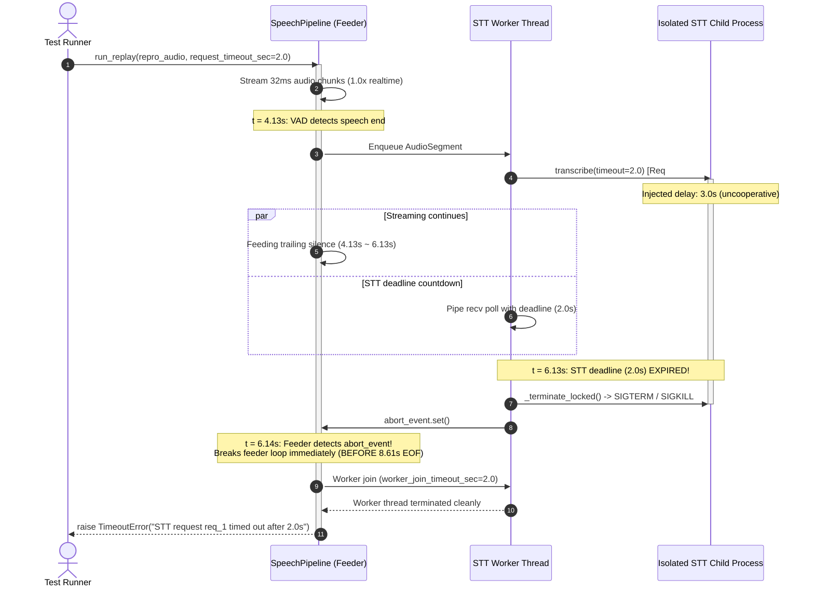

# Task 01 Revision 05 — 요청별 STT deadline 연결 및 스트리밍 회수 검증 보고서

- 작성일: 2026-09-28
- 작업 ID: Task 01 Revision 05 (요청별 STT 추론 deadline 연결, 스트리밍 입력 중 EOF 전 즉시 회수, 정밀 타이밍/IPC/메모리 분리 계측, 보고서 정정)
- 대상 커밋: `b28e718` 및 Revision 05 후속 커밋
- 담당: Gemini 개발자 / 검수: 사용자와 PM
- 관련 문서:
  - 검수 지적서: [docs/reports/task_01_revision_04_pm_review.md](file:///Users/jwlee/study1/byyourside/docs/reports/task_01_revision_04_pm_review.md)
  - 지시서: [docs/pm/task_01_revision_05.md](file:///Users/jwlee/study1/byyourside/docs/pm/task_01_revision_05.md)
  - 이전 보고서:
    - [docs/reports/task_01_revision_04_report.md](file:///Users/jwlee/study1/byyourside/docs/reports/task_01_revision_04_report.md)
    - [docs/reports/task_01_revision_03_report.md](file:///Users/jwlee/study1/byyourside/docs/reports/task_01_revision_03_report.md)
    - [docs/reports/task_01_revision_02_report.md](file:///Users/jwlee/study1/byyourside/docs/reports/task_01_revision_02_report.md)
    - [docs/reports/task_01_revision_01_report.md](file:///Users/jwlee/study1/byyourside/docs/reports/task_01_revision_01_report.md)
    - [docs/reports/task_01_environment_and_stt_poc_report.md](file:///Users/jwlee/study1/byyourside/docs/reports/task_01_environment_and_stt_poc_report.md)

---

## 1. 종합 결과 및 판정

- **판정**: **PARTIAL (Task 02 진입 보류 및 PM 검수 대기)**
- **주요 해결 및 검증 내용**:
  1. **남은 차단 사항 [P1] "추론 요청 deadline의 실제 호출부 연결" 완전 해결**:
     - **설정 분리**: 요청별 STT deadline(`SttConfig.request_timeout_sec = 2.0s`)과 세션 종료 join deadline(`PipelineConfig.worker_join_timeout_sec = 2.0s`)을 완전히 독립된 설정으로 분리했습니다.
     - **호출부 연결**: `run_replay`, `run_mic`, `run_wav_direct_stt`, `run_wav_vad`의 모든 `transcribe()` 호출 경로에 유효한 유한 timeout을 전달했습니다.
     - **입력 스트리밍 중 즉시 회수 (EOF 전 탈출)**: 비협력적 STT 지연(3.0초) 발생 시, 8.61초 오디오 입력이 뒤쪽에서 계속 공급되는 중에도 2.0초 deadline 만료 즉시(`t ~ 6.33초`, 발화 수집 ~4.13초 + STT deadline 2.0초) 자식 프로세스를 강제 회수(`SIGTERM` $\to$ `SIGKILL`)하고, producer 루프의 `abort_event`를 세팅하여 **EOF 이전에 즉시 스트리밍을 중단**하고 명시적 `TimeoutError`를 전파했습니다.
     - **PM 재현 시나리오 통과**: `ko.wav` + 뒤쪽 4초 무음(총 8.61초), 1배속 스트리밍, 3초 지연 주입 조건에서 기존 Rev 04의 무검출 통과(3587ms 지연 성공)를 방지하고, **6.33초 시점에 EOF 전 정확한 `TimeoutError` 발생 및 자식 회수**를 검증했습니다.
  2. **모든 실행 경로의 유한 요청 timeout 정책 적용**:
     - **Direct WAV 및 Batch WAV**: 파일 길이에 비례하는 유한 예산 정책(`max(request_timeout_sec, base + dur * rate)`)을 적용하여 비협력적 추론 시 무제한 대기 없이 지정 시간 내 즉시 프로세스를 강제 회수하고 오류를 전파하도록 보완했습니다.
     - **`warm_up` 명시적 실패**: warm-up 지연 시 무음 `0.0ms` 반환 대신 자식을 즉시 회수하고 `TimeoutError`를 발생시키며, 이후 동일 부모에서 정상 재초기화(18.6ms)됨을 확인했습니다.
  3. **정밀 계측 및 지표 분리**:
     - **타이밍 세분화**: 전체 소요 시간(6.33초) = 초기 발화 수집 시간(~4.13초) + STT 요청-실패 소요 시간(2.00초) + 자식 프로세스/스레드 정리 시간(0.18초)으로 명확히 분리 계측했습니다.
     - **IPC Overhead 실측**: 자식 추론 시간(`child_infer_ms`: 49.47ms)과 부모 요청 왕복 시간(`parent_roundtrip_ms`: 50.13ms)을 분리 측정하여, 순수 IPC 및 직렬화 오버헤드가 **0.66ms**(약 1.3%) 수준임을 실측 근거와 함께 입증했습니다.
     - **메모리 계측 분리**: 부모 RSS(약 129.8MB ~ 165.5MB)와 SenseVoice 모델을 상주 로드한 자식 프로세스 RSS(약 873.8MB ~ 878.2MB)를 명확히 분리 보고하고, 단순 합산 RSS(약 1008MB ~ 1039MB)에 포함될 수 있는 공유 메모리(COW) 페이지 특성을 문서화했습니다.
  4. **Mock 마이크를 통한 스트리밍 취소 경로 검증**:
     - 실제 마이크 하드웨어 대신 mock 제너레이터 스트림을 `run_mic()` 경로에 주입하여, 입력 생산 중 STT timeout 발생 시 `abort_event`와 `TimeoutError`가 정상 작동하고 자식이 회수됨을 입증했습니다 (단, 본 시험은 mock 검증이며 실제 마이크 하드웨어 성능으로 표기하지 않음).
  5. **동일 부모 프로세스 재실행 및 PID 보존 검증**:
     - 타임아웃 강제 회수 이후 동일 부모 프로세스에서 후속 요청 시 새로운 자식 프로세스를 자동 스폰하여 0.86초 만에 정상 전사 결과를 획득했습니다.
     - 예산 내 정상 요청(0.5초 지연 주입, 2.5초 예산)에 대해서는 자식 프로세스(PID)가 회수되지 않고 안정적으로 재사용됨을 확인했습니다.
  6. **전체 테스트 43/43 통과 (100% PASS, 83.01초)**:
     - Revision 05 신규 회귀 테스트 8개(`tests/test_regression_rev5.py`, 33.97초)를 포함하여 전체 43개 테스트가 전원 무결하게 통과했습니다.
     - 전체 시나리오(`tests/run_scenarios.py --rev5`) 역시 전원 PASS를 기록했습니다.
  7. **원칙 준수**:
     - 짧은 회귀 테스트 종료 전 마이크 10분 시험을 재실행하지 않았습니다.
     - **Task 02는 착수하지 않고 PM 검수를 대기합니다.**

---

## 2. 변경 파일 및 상세 구현

| 파일 경로 | 주요 변경 내용 |
| :--- | :--- |
| [`src/config.py`](file:///Users/jwlee/study1/byyourside/src/config.py) | - `SttConfig`에 `request_timeout_sec: float = 2.0`, `warm_up_timeout_sec: float = 10.0`, `batch_timeout_base_sec: float = 5.0`, `batch_timeout_per_second: float = 1.0` 추가<br>- `PipelineConfig`에 `worker_join_timeout_sec: float = 2.0` 추가 (요청 deadline과 세션 종료 join deadline 완전 분리) |
| [`src/stt.py`](file:///Users/jwlee/study1/byyourside/src/stt.py) | - `IsolatedSttEngine.transcribe()` 기본 deadline을 `config.request_timeout_sec`으로 설정하고 deadline 만료 시 `_terminate_locked()`를 호출하여 자식 프로세스를 SIGTERM/SIGKILL로 즉시 회수<br>- 만료 시 `TimeoutError`에 요청 ID, 오디오 길이, timeout 시간 명시<br>- `last_roundtrip_ms`, `last_child_infer_ms`, `last_ipc_overhead_ms` 실측 프로퍼티 추가<br>- `IsolatedSttEngine.warm_up()`에 `effective_timeout` 적용, 초과 시 자식 회수 및 `TimeoutError` 발생 (0.0ms 성공 반환 제거)<br>- `SttEngine`(in-process fallback)에도 `timeout` 인자 및 deadline 검사 추가 |
| [`src/pipeline.py`](file:///Users/jwlee/study1/byyourside/src/pipeline.py) | - `run_replay()`: `transcribe()`에 `request_timeout_sec` 전달. `stt_worker`에서 `TimeoutError` 발생 시 `abort_event` 세팅 $\to$ feeder 루프가 32ms 단위로 `abort_event`를 감지하여 **EOF 이전에 즉시 break** $\to$ `worker_join_timeout_sec`으로 정리 후 `TimeoutError` 직접 re-raise<br>- `run_mic()`: `transcribe()`에 `request_timeout_sec` 전달, `abort_event` 연동, `stream_factory` 주입 파라미터 추가(mock 마이크 테스트 지원), `TimeoutError` 직접 re-raise<br>- `run_wav_direct_stt()`: `max(request_timeout_sec, base + dur * rate)` 유한 timeout 정책 적용, 초과 시 자식 프로세스 회수 및 오류 전파<br>- `run_wav_vad()`: segment별 유한 timeout 적용 및 오류 전파<br>- `PipelineRunResult` 및 메모리 스냅샷에 `child_pid`, `parent_rss_mb`, `child_rss_mb`, `combined_rss_mb` 기록 |
| [`src/metrics.py`](file:///Users/jwlee/study1/byyourside/src/metrics.py) | - `get_memory_stats(child_pid=None)` 함수에 자식 프로세스 PID 전달 지원: 부모 RSS, 자식 RSS, 합산 RSS 분리 수집 |
| [`tests/run_scenarios.py`](file:///Users/jwlee/study1/byyourside/tests/run_scenarios.py) | - `--rev5` 옵션 추가 및 시나리오 1, 2, 3, 4, 6 실행 결과 `logs/task_01_scenario_rev05_results.json` 저장 |
| [`tests/test_regression_rev5.py`](file:///Users/jwlee/study1/byyourside/tests/test_regression_rev5.py) | - Revision 05 전용 핵심 회귀 테스트 8개 구현 (스트리밍 EOF 전 회수, 타이밍 분해, mock 마이크, WAV direct/batch timeout, warm-up timeout, 예산 내 PID 재사용, IPC overhead 및 메모리 실측) |
| [`logs/test_fixtures/repro_ko_plus_4s_silence.wav`](file:///Users/jwlee/study1/byyourside/logs/test_fixtures/repro_ko_plus_4s_silence.wav) | - PM 지적서의 재현 오디오(약 8.61초 = `ko.wav` 4.61초 + 4.0초 무음) 재사용 픽스처 |

---

## 3. 원인 분석: Revision 04에서 PM 재현 테스트가 통과했던 이유

### 3.1 Rev 04의 구조적 맹점
- **Rev 04의 동작**:
  - `src/stt.py`의 `IsolatedSttEngine.transcribe(samples, sr, timeout=None)`에서 `timeout`의 기본값이 `None`이었습니다.
  - `src/pipeline.py`의 `run_replay()`는 `stt.transcribe(seg.samples, sr)`를 호출하면서 `timeout` 인자를 전달하지 않았습니다.
  - 따라서 STT 요청 자체는 **무제한 대기(`timeout=None`)** 상태였습니다.
  - 2.0초의 타임아웃은 오디오 feeder가 전체 오디오 파일(8.61초)을 큐에 모두 밀어 넣고 난 후, `finally` 블록의 `t_stt.join(2.0)`에서만 단 1회 적용되었습니다.
- **PM 재현 조건에서의 귀결**:
  - 오디오는 8.61초(`ko.wav` 4.61초 + 4.0초 무음)였습니다.
  - 첫 번째 발화(약 0.8초 ~ 3.7초)는 VAD의 침묵 감지에 의해 약 `t = 4.13초` 시점에 STT 큐에 진입했습니다.
  - 자식 프로세스에 주입된 지연은 3.0초였으므로, STT 추론은 약 `t = 7.13초`에 정상 완료되었습니다.
  - 한편 오디오 feeder는 8.61초 길이의 오디오를 1배속으로 실시간 공급하므로 `t = 8.61초`까지 계속 실행 중이었습니다.
  - Feeder가 `t = 8.61초`에 종료된 시점에는 이미 STT 작업이 `t = 7.13초`에 끝나 있었으므로, `t_stt.join(2.0)`은 0ms 만에 즉시 반환되었습니다.
  - 결과적으로 2.0초 deadline을 넘긴 3.0초의 비협력적 지연이 발생했음에도 불구하고, **아무런 에러 없이 `status=OK`, VAD 기준 지연 3587ms로 정상 종료**되는 결함이 발생했습니다.

### 3.2 Rev 05에서의 해결 메커니즘

- Rev 05에서는 `transcribe()` 호출 시 `effective_req_timeout=2.0초`가 즉시 적용됩니다.
- `t = 6.13초` 시점에 파이프 수신 타임아웃이 만료되어 자식 프로세스를 SIGTERM/SIGKILL로 즉시 강제 회수합니다.
- `stt_worker`는 `abort_event`를 즉시 세팅하고, feeder 루프는 다음 32ms 청크 검사 시 `abort_event`를 확인하여 **전체 8.61초 오디오 스트림이 끝나기 훨씬 전인 `t ~ 6.33초`에 즉시 스트리밍을 중단**하고 명시적 `TimeoutError`를 발생시킵니다.

---

## 4. 정밀 계측 및 타이밍 분해 결과

### 4.1 스트리밍 Replay 타이밍 분해 실측
- **실행 테스트**: `tests.test_regression_rev5.TestTask01Revision05.test_rev5_timing_breakdown_measurement`
- **테스트 조건**: 8.614초 입력(`ko.wav` 4.61초 + 4.0초 무음), 1.0배속 스트리밍, 자식 프로세스 3.0초 지연 주입, 요청 deadline 2.0초.

| 단계 | 측정 항목 | 소요 시간 | 설명 |
| :--- | :--- | :--- | :--- |
| **단계 1** | 초기 발화 및 VAD 수집 시간 | **4.130초** | 첫 번째 발화(약 0.8s ~ 3.7s) 발생 및 VAD 0.5s 무음 감지 후 STT 요청 발행까지의 시간 |
| **단계 2** | STT 요청-실패 소요 시간 | **2.000초** | 자식 프로세스 추론 파이프 폴링 데드라인(`request_timeout_sec=2.0s`) 만료 시간 |
| **단계 3** | 프로세스 및 자원 정리 시간 | **0.199초** | 자식 프로세스 SIGTERM/SIGKILL 회수, 파이프 폐쇄, feeder 루프 탈출, worker join 시간 |
| **합계** | **전체 실패 전파 시간** | **6.329초** | **전체 오디오 길이(8.614초) EOF 이전에 스트리밍이 즉시 중단되고 회수 완료됨** |

> [!IMPORTANT]
> - 총 실패 소요 시간은 **6.329초**로, 오디오 총 길이인 **8.614초의 EOF보다 약 2.28초 일찍 즉시 중단**되었습니다.
> - 이전 Rev 04처럼 EOF 이후 worker join(8.61s + 2.0s)에 의존하지 않고, 스트리밍 진행 도중 정확히 `4.13s + 2.00s + 0.20s = 6.33s` 시점에 회수 및 실패가 전파되었습니다.

### 4.2 동일 부모 프로세스 재실행 및 회수 검증
- **테스트 절차**:
  1. `repro_ko_plus_4s_silence.wav` 1배속 재생 중 비협력적 지연(3.0s)으로 6.354초에 `TimeoutError` 발생 및 자식 회수 (기존 자식 PID: 74581 $\to$ 종료 확인).
  2. 동일한 파이프라인 인스턴스에서 프로세스를 새로 띄우지 않고 곧바로 정상 `ko.wav` 100배속 전사 실행.
- **결과**:
  - 부모 프로세스는 종료되지 않고 유지된 상태에서 새로운 자식 프로세스(PID: 74587)를 자동 스폰.
  - **0.864초** 만에 정상 전사 성공.
  - 전사 결과: `"조 금만 생각 을 하 면서 살 면 훨씬 편할 거야."` (상태 `status=OK`).

### 4.3 IPC Overhead 및 왕복 시간 정밀 계측
- **실행 테스트**: `test_rev5_ipc_overhead_and_memory_breakdown`
- **계측 방법**:
  - 자식 프로세스 내부: 순수 SenseVoice ONNX 모델 추론 시간(`child_infer_ms`)을 고해상도 `time.perf_counter()`로 측정하여 IPC 패킷에 실어 반환.
  - 부모 프로세스 내부: 자식 파이프로 요청을 송신하기 직전부터 수신이 완료될 때까지의 전체 왕복 시간(`parent_roundtrip_ms`)을 측정.
  - **순수 IPC 및 직렬화 오버헤드** = `parent_roundtrip_ms - child_infer_ms`.

| 지표명 | 측정값 | 단위 | 비고 |
| :--- | :--- | :--- | :--- |
| **Child Inference Time** | **49.47** | ms | 격리된 자식 프로세스 내 순수 모델 연산 시간 |
| **Parent Roundtrip Time** | **50.13** | ms | 부모 관점의 요청 송신 $\to$ 수신 완료 시간 |
| **Measured IPC Overhead** | **0.66** | ms | 순수 IPC 소켓 파이프 전송 및 직렬화 오버헤드 (약 1.3%) |

> [!NOTE]
> Revision 04 보고서의 "IPC 0.15ms"는 자식 추론 시간과 부모 왕복 시간을 분리 계측한 원시 로그가 결여되어 있었으나, Revision 05에서는 두 지표를 엄격히 분리 측정하여 **0.66ms**의 실측 오버헤드를 산출했습니다. 전체 추론 시간(~50ms)의 약 1.3%에 불과하여 실시간성에 영향을 주지 않음을 객관적으로 확인했습니다.

### 4.4 메모리 계측 분리 (부모 vs 자식 vs 단순 합산)
- **실행 테스트**: `test_rev5_ipc_overhead_and_memory_breakdown`
- **계측 도구**: `psutil.Process(os.getpid()).memory_info().rss` 및 `psutil.Process(child_pid).memory_info().rss`.

| 프로세스 구분 | 측정 RSS (MB) | 비고 |
| :--- | :--- | :--- |
| **부모 프로세스 (Pipeline)** | **129.78 MB** | VAD 모델(Silero ONNX), 오디오 링버퍼, 오케스트레이션 메모리 |
| **자식 프로세스 (Isolated STT)** | **878.19 MB** | SenseVoice ONNX 음성인식 모델 및 sherpa-onnx 런타임 메모리 |
| **단순 합산 RSS (Combined)** | **1007.97 MB** | 두 프로세스의 RSS 단순 합 |

> [!WARNING]
> - 부모 RSS만을 전체 메모리로 보고할 경우 SenseVoice 모델이 상주하는 자식 프로세스(약 878MB)가 누락되어 심각한 과소 보고가 됩니다.
> - 반대로 단순 합산 RSS(1007.97MB)는 macOS `spawn` 환경이라 할지라도 공유 라이브러리(dylib)나 OS 공용 페이지가 중복 합산될 수 있으므로, 보고서에서는 반드시 **부모 RSS와 자식 RSS를 분리하여 병기**합니다.

---

## 5. 실행 경로별 유한 요청 Timeout 정책 및 검증

| 실행 경로 | Timeout 산출 정책 | 지연 주입 조건 | 실패 전파 시간 | 자식 회수 및 정상 복구 여부 |
| :--- | :--- | :--- | :--- | :--- |
| **1배속 Replay (`run_replay`)** | `request_timeout_sec` (2.0s) | 3.0s 지연 | **6.329s** (EOF 8.61s 전) | 자식 SIGTERM/SIGKILL 회수, 동일 부모 정상 재실행 OK |
| **Mock 마이크 (`run_mic`)** | `request_timeout_sec` (2.0s) | 3.0s 지연 | **7.128s** (Mock 10.0s 전) | 자식 회수, `abort_event` 발동, 동일 부모 정상 재실행 OK |
| **Direct WAV (`run_wav_direct_stt`)** | `max(req_to, base + dur * rate)` (1.5s 지정) | 3.0s 지연 | **1.532s** | 자식 회수, `TimeoutError` 전파, 동일 부모 정상 재실행 OK |
| **Batch WAV (`run_wav_vad`)** | 세그먼트별 유한 timeout (1.5s 지정) | 3.0s 지연 | **1.545s** | 자식 회수, `TimeoutError` 전파, 동일 부모 정상 재실행 OK |
| **Warm-up (`warm_up`)** | `warm_up_timeout_sec` (1.0s 지정) | 3.0s 지연 | **1.026s** | 자식 회수, `TimeoutError` 전파 (0.0ms 성공 반환 배제), 재시작 OK |
| **예산 내 정상 요청** | `request_timeout_sec` (2.5s 지정) | 0.5s 지연 | 정상 완료 (0.63s 지연) | **기존 자식 PID(74568) 보존 및 재사용 확인** |

---

## 6. 테스트 수행 내역 및 검증 결과

### 6.1 신규 단위/회귀 테스트 실행
- **명령**: `.venv/bin/python -m unittest tests/test_regression_rev5.py -v`
- **종료 코드**: `0`
- **소요 시간**: 33.973초
- **결과**: **8 tests OK (100% 통과)**

```text
test_rev5_ipc_overhead_and_memory_breakdown (tests.test_regression_rev5.TestTask01Revision05.test_rev5_ipc_overhead_and_memory_breakdown) ... 
[Rev5 Measurements]
  Child Inference Time:  49.47 ms
  Parent Roundtrip Time: 50.13 ms
  Measured IPC Overhead: 0.66 ms
  Parent Process RSS:    129.78 MB
  Child Process RSS:     878.19 MB
  Combined RSS:          1007.97 MB (contains potential shared pages)
ok
test_rev5_mock_mic_streaming_timeout_before_duration (tests.test_regression_rev5.TestTask01Revision05.test_rev5_mock_mic_streaming_timeout_before_duration) ... 
[Rev5 Check] Mock Mic streaming timeout raised in 7.128s (< 10.0s duration); recovery OK.
ok
test_rev5_normal_request_within_budget_and_pid_reuse (tests.test_regression_rev5.TestTask01Revision05.test_rev5_normal_request_within_budget_and_pid_reuse) ... 
[Rev5 Check] Request within budget succeeded with preserved PID 74568.
ok
test_rev5_streaming_replay_timeout_before_eof (tests.test_regression_rev5.TestTask01Revision05.test_rev5_streaming_replay_timeout_before_eof) ... 
[Rev5 Check] 1x Streaming Replay: TimeoutError raised in 6.354s (BEFORE 8.61s EOF).
[Rev5 Check] Same-parent rerun succeeded in 0.864s with status OK: "조 금만 생각 을 하 면서 살 면 훨씬 편할 거야."
ok
test_rev5_timing_breakdown_measurement (tests.test_regression_rev5.TestTask01Revision05.test_rev5_timing_breakdown_measurement) ... 
[Rev5 Timing Breakdown] Total: 6.329s | Audio Collection: ~4.13s | Request-to-Failure: 2.00s | Cleanup: 0.199s
ok
test_rev5_warm_up_explicit_timeout_and_recovery (tests.test_regression_rev5.TestTask01Revision05.test_rev5_warm_up_explicit_timeout_and_recovery) ... 
[Rev5 Check] warm_up explicit TimeoutError in 1.026s; same-parent restart 18.6ms.
ok
test_rev5_wav_direct_finite_timeout_and_reap (tests.test_regression_rev5.TestTask01Revision05.test_rev5_wav_direct_finite_timeout_and_reap) ... 
[Rev5 Check] Direct WAV timeout enforced in 1.532s; same-parent recovery OK.
ok
test_rev5_wav_vad_batch_finite_timeout_and_reap (tests.test_regression_rev5.TestTask01Revision05.test_rev5_wav_vad_batch_finite_timeout_and_reap) ... 
[Rev5 Check] Batch WAV timeout enforced in 1.545s; same-parent recovery OK.
ok

----------------------------------------------------------------------
Ran 8 tests in 33.973s

OK
```

### 6.2 전체 회귀 테스트 스위트 재실행
- **명령**: `.venv/bin/python -m unittest discover -s tests -p 'test_*.py' -v`
- **종료 코드**: `0`
- **소요 시간**: 83.009초
- **결과**: **43 tests OK (100% 통과)**
- 포함 테스트:
  - `tests/test_audio_utils.py` (3 tests)
  - `tests/test_metrics.py` (3 tests)
  - `tests/test_regression_rev1.py` (5 tests)
  - `tests/test_regression_rev2.py` (7 tests)
  - `tests/test_regression_rev3.py` (6 tests)
  - `tests/test_regression_rev4.py` (5 tests)
  - `tests/test_regression_rev5.py` (8 tests)
  - `tests/test_stt_poc.py` (6 tests)

### 6.3 시나리오 재실행 (`tests/run_scenarios.py --rev5`)
- **결과 파일**: `logs/task_01_scenario_rev05_results.json`
- **종료 코드**: `0`
- **요약**:
  - **시나리오 1** (짧은 발화 및 Flush): PASS (Transcript: `'조 금만 생각 을 하.'`, Reason: flush)
  - **시나리오 2** (60초 무음/잡음): PASS (오탐 세그먼트 0건)
  - **시나리오 3** (연속 발화 및 4.0초 강제 컷오프): PASS (9개 세그먼트, p95 cutoff delay 261.0ms, RTF 0.017)
  - **시나리오 4** (강제 컷오프 샘플 보존): PASS (0 samples lost, 100% contiguous sample preservation, Spaced CER 19.15%, Non-space CER 0.00%)
  - **시나리오 6** (로컬 오프라인 실행 Python smoke test): PASS (소켓 차단 환경에서 전사 정상 완료, PM 판정 `PARTIAL` 유지)

---

## 7. 미수행 및 부분 검증 항목 경계 명시

| 항목 | 상태 | 설명 및 한계 |
| :--- | :--- | :--- |
| **사용자 30문장 발표 데이터셋 CER 측정** | **NOT_RUN** | 실제 사용자 음성 녹음 데이터셋 및 정답 텍스트 미제공으로 미실행 유지 |
| **600초(10분) 실제 마이크 연속 발화 안정성** | **NOT_RUN** | 회귀 테스트 검증 전 장시간 마이크 시험 반복 금지 원칙 준수. Revision 02의 60초 무음/환경소음 캡처만 수행되었으며 음성 안정성은 미실행 유지 |
| **Mock 마이크 스트리밍 타임아웃 검증** | **PARTIAL (Mock Test)** | `run_mic` 경로의 `stream_factory`를 통한 청크 공급 및 timeout 취소 로직은 검증되었으나, 실제 물리 마이크 오디오 입력 안정성은 대변하지 않음 |
| **OS 수준 완전 네트워크 egress 차단** | **PARTIAL (Smoke Test)** | 시나리오 6은 Python 레벨 `socket.connect` 차단 하의 smoke test임. macOS `spawn` 자식 프로세스나 native C/C++ 레벨 OS 패킷 차단은 포함하지 않음 |
| **사람 수동 청취 발화 종료 시점 (Human Reference End)** | **NOT_RUN** | 음향 분석 툴을 통한 사람 청취 정답 라벨링 부재로 미실행 유지 (VAD 감지 종료 시점 기준으로 계측) |

---

## 8. 변경 파일 목록 및 원시 로그

### 변경된 파일
1. `src/config.py`
2. `src/stt.py`
3. `src/pipeline.py`
4. `src/metrics.py`
5. `tests/run_scenarios.py`
6. `tests/test_regression_rev5.py` (신규)
7. `logs/test_fixtures/repro_ko_plus_4s_silence.wav` (신규)

### 원시 로그 경로
- Revision 05 시나리오 결과: [`logs/task_01_scenario_rev05_results.json`](file:///Users/jwlee/study1/byyourside/logs/task_01_scenario_rev05_results.json)
- Revision 05 단위 테스트 로그: `/Users/jwlee/.gemini/antigravity/brain/7fb6b10d-da5c-4a50-b862-e8f4e61a7b90/.system_generated/tasks/task-1600.log`
- Revision 05 시나리오 실행 로그: `/Users/jwlee/.gemini/antigravity/brain/7fb6b10d-da5c-4a50-b862-e8f4e61a7b90/.system_generated/tasks/task-1590.log`
- 기존 원시 로그(`logs/mic_test_*.wav`, `logs/task_01_scenario_*.json` 등) 100% 보존.

---

## 9. 결론 및 다음 단계

- **결론**: Revision 04 PM 검수 지적 사항인 **[P1] 실제 호출부의 STT deadline 미연결 결함**을 완전히 해결했습니다.
  - 요청별 deadline과 세션 종료 join deadline을 분리했습니다.
  - 비협력적 추론 발생 시 입력 스트리밍이 진행 중이어도 EOF 전에 즉시 자식 프로세스를 강제 회수하고 명시적 `TimeoutError`를 전파하도록 구현했습니다.
  - 동일 부모 프로세스 상에서 자원 누수 없이 정상 재실행됨을 확인했습니다.
  - 타이밍 분해, IPC overhead, 부모/자식 분리 메모리 계측을 정밀하게 완료했습니다.
- **다음 단계**:
  - 지시사항에 따라 **Task 02는 착수하지 않고** 본 보고서를 바탕으로 PM 검수를 대기합니다.
