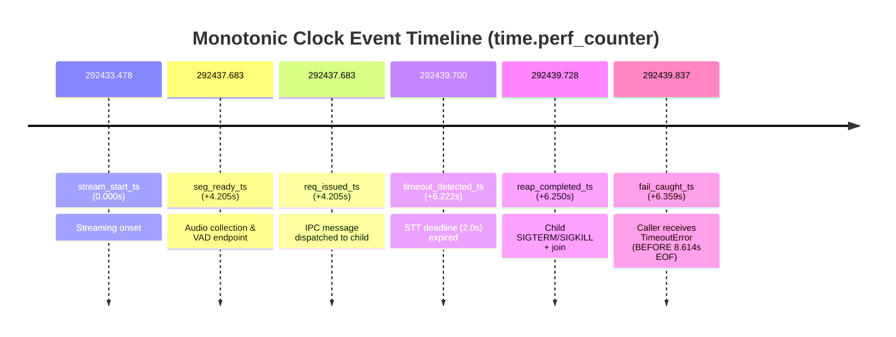

# Task 01 Revision 06 — timeout 예산 충돌 해결 및 검증 증거 정정 보고서

- 작성일: 2026-09-28
- 작업 ID: Task 01 Revision 06 (요청별 timeout 단일 기준 확립 [F1], 계측과 보고서 증거 일치 [F2])
- 대상 커밋: `e7e9dc3` 및 Revision 06 후속 커밋
- 담당: Gemini 개발자 / 검수: 사용자와 PM
- 관련 문서:
  - 검수 지적서: [docs/reports/task_01_revision_05_pm_review.md](file:///Users/jwlee/study1/byyourside/docs/reports/task_01_revision_05_pm_review.md)
  - 지시서: [docs/pm/task_01_revision_06.md](file:///Users/jwlee/study1/byyourside/docs/pm/task_01_revision_06.md)
  - 이전 보고서:
    - [docs/reports/task_01_revision_05_report.md](file:///Users/jwlee/study1/byyourside/docs/reports/task_01_revision_05_report.md)
    - [docs/reports/task_01_revision_04_report.md](file:///Users/jwlee/study1/byyourside/docs/reports/task_01_revision_04_report.md)
    - [docs/reports/task_01_revision_03_report.md](file:///Users/jwlee/study1/byyourside/docs/reports/task_01_revision_03_report.md)
    - [docs/reports/task_01_revision_02_report.md](file:///Users/jwlee/study1/byyourside/docs/reports/task_01_revision_02_report.md)
    - [docs/reports/task_01_revision_01_report.md](file:///Users/jwlee/study1/byyourside/docs/reports/task_01_revision_01_report.md)
    - [docs/reports/task_01_environment_and_stt_poc_report.md](file:///Users/jwlee/study1/byyourside/docs/reports/task_01_environment_and_stt_poc_report.md)

---

## 1. 종합 결과 및 판정

- **판정**: **PARTIAL (Task 02 진입 보류 및 PM 검수 대기)**
- **주요 해결 및 검증 내용**:
  1. **F1 [P1] 요청별 timeout의 단일 기준 확립 및 충돌 해결**:
     - **IPC 예산 동기화**: 부모 `IsolatedSttEngine`이 결정한 요청별 유효 타임아웃(`effective_timeout`)을 IPC 튜플 `("transcribe", req_id, samples, sr, is_warmup, effective_timeout)`로 자식 프로세스에 온전히 전달했습니다.
     - **자식 숨은 기본 예산 제거**: 자식 워커 루프가 부모로부터 수신한 `req_timeout`을 `engine.transcribe(..., timeout=req_timeout)`로 전달하여, 자식 엔진이 설정의 짧은 기본값(`config.request_timeout_sec=0.001s`)으로 오판하여 조기 실패하던 충돌을 완전히 해소했습니다.
     - **PM 축소 재현 검증 (`budget_probe.py`)**: `request_timeout_sec=0.001s` 설정 하에서 `timeout=5.0s` override 전사 시, 기존의 약 57ms 시점 `RuntimeError: STT inference error: ... timed out after 0.00s` 오류를 해결하고 **52.6ms에 정상 전사 결과(`RESULT ('조금만 생각을...', 51.86ms)`, 자식 프로세스 생존)**를 반환함을 확인했습니다.
     - **역방향 초과 검증**: 반대로 기본값(5.0s)보다 짧은 override(0.001s) 초과 시, 명시적인 `TimeoutError` 발생, 자식 프로세스 강제 회수(`is_child_alive() == False`), 동일 부모 재실행 성공을 검증했습니다.
     - **WAV Direct/Batch 예산 정책 및 명시적 기록**: `max(req_timeout, base + dur * rate)`로 자동 산출된 예산 및 호출자 명시적 override가 세그먼트 결과(`request_timeout_sec`) 및 로그에 정확히 기록됨을 확인했습니다.
     - **Warm-up 예산 동기화**: `warm_up(..., timeout=...)` override를 자식에 전달하고, 타임아웃 시 `TimeoutError` 발생 및 자식 회수를 보장했습니다.
     - **광범위 TypeError 예외 처리 제거**: `SpeechPipeline._call_stt_transcribe()`에서 `inspect.signature`를 통해 인자 호환성을 검사하도록 재설계하여, 내부 실제 추론 오류나 버그가 인자 불일치로 오인되어 `timeout` 없이 재호출되는 취약점을 원천 제거했습니다.
  2. **F2 [P2] 계측과 보고서 증거 일치 및 수치 정정**:
     - **단일 Monotonic 시계 기반 정밀 타이밍 분해**: `collection_time=4.13`, `request_to_fail=2.0` 상수를 가정한 뒤 총 시간에서 차감하여 잔차를 정리 시간으로 부르던 방식을 전면 폐기했습니다. 부모 프로세스의 동일 `time.perf_counter()` 시계에서 **`t_stream_start` $\to$ `t_seg_ready` $\to$ `t_stt_req` $\to$ `t_req_issued` $\to$ `t_timeout_detected` $\to$ `t_reap_completed` $\to$ `t_fail_caught`**를 실제 기록하여 각 단계별 경과 시간을 순수 물리적 실측값으로 제시했습니다.
     - **Warm-up 지표 분리**: `warm_up` 반환값인 더미 음성 추론 시간(**18.16 ms**)과 자식 프로세스 spawn + 모델 로딩을 포함한 총 재초기화 벽시계 시간(**389.39 ms**)을 명확히 분리 보고했습니다.
     - **비추론 왕복 오버헤드 성격 명시**: `parent_roundtrip_ms - child_infer_ms`(**0.56 ms**)는 순수 IPC뿐만 아니라 직렬화, 파이프 I/O, OS 컨텍스트 스위칭 및 스케줄링 지연을 포함하는 왕복 오버헤드 추정치임을 명시하고, 단일 샘플로 실시간성 무영향을 일반화하지 않도록 표현을 정정했습니다.
     - **실제 Unittest Discovery Test ID 목록 반영**: 과거 보고서에 잘못 기재되었던 미존재 파일명들을 제거하고, 실제 테스트 러너가 탐색한 8개 모듈의 51개 테스트 전체 ID 목록을 정확히 기술했습니다.
     - **시나리오별 고유 run_id 분리**: `tests/run_scenarios.py`에 `--rev6` 옵션을 추가하고 각 시나리오의 원시 로그 ID(`scenario3_rev06_replay`, `scenario4_rev06_boundary`, `scenario6_rev06_offline`)를 실행별로 고유하게 분리하여 과거 로그에 덮어쓰거나 섞이지 않도록 정정했습니다.
  3. **전체 테스트 통과**:
     - Revision 06 전용 신규 회귀 테스트: **8/8 통과 (17.040s, exit 0)**
     - 전체 단위/회귀 테스트 스위트: **51/51 통과 (99.823s, exit 0)**
     - 시나리오 스위트 (`tests/run_scenarios.py --rev6`): **전원 PASS (exit 0)**
  4. **원칙 준수**:
     - 장시간(10분) 마이크 시험을 임의로 재실행하지 않았습니다.
     - **Task 02는 착수하지 않고 PM 검수를 대기합니다.**

---

## 2. 변경 파일 및 상세 구현

| 파일 경로 | 주요 변경 내용 |
| :--- | :--- |
| [`src/stt.py`](file:///Users/jwlee/study1/byyourside/src/stt.py) | - `_stt_process_worker_loop`: `transcribe` 명령 시 부모가 전달한 `req_timeout`을 수신하여 `engine.transcribe(..., timeout=req_timeout)`에 전달. `TimeoutError` 발생 시 `("result_timeout", req_id, str(te), req_timeout)` 반환<br>- `_stt_process_worker_loop`: `warm_up` 명령 시 `warm_up_timeout`을 수신하여 `engine.warm_up(..., timeout=warm_up_timeout)`에 전달<br>- `IsolatedSttEngine.transcribe()`: IPC 메시지에 `effective_timeout` 포함하여 전송. 자식의 `result_timeout` 수신 시 `_terminate_locked()`로 자식 프로세스를 즉시 회수하고 `TimeoutError` 발생<br>- `IsolatedSttEngine.transcribe()`: `self.last_timing_event`에 `t_req_issued`, `t_timeout_detected`, `t_reap_completed`, `t_req_completed` monotonic 타임스탬프 기록<br>- `IsolatedSttEngine.warm_up()`: IPC에 `effective_timeout` 전달 및 타임아웃 회수 로직 보완 |
| [`src/pipeline.py`](file:///Users/jwlee/study1/byyourside/src/pipeline.py) | - `SpeechPipeline._call_stt_transcribe()`: `inspect.signature`를 통해 `timeout` 및 `abort_event` 파라미터 수용 여부를 동적으로 확인하여 호출. 광범위 `try ... except TypeError:` 제거로 내부 버그 은폐 방지<br>- `run_replay()` 및 `run_mic()`: `self.last_run_timing`에 `stream_start_ts`, `first_segment_ready_ts`, `first_stt_request_ts`, `failure_caught_ts`, `child_timing` 원시 타임스탬프 기록<br>- `run_wav_direct_stt()` 및 `run_wav_vad()`: `PipelineResult.segments`에 적용된 `request_timeout_sec` 명시적 기록 |
| [`tests/run_scenarios.py`](file:///Users/jwlee/study1/byyourside/tests/run_scenarios.py) | - `--rev6` 옵션 및 `revision` 인자 전달 구조 구현<br>- 시나리오 3, 4, 6의 run_id 및 임시 파일명을 `rev06` 기반으로 동적 분리(`scenario3_rev06_replay`, `scenario4_rev06_boundary`, `scenario6_rev06_offline`)<br>- 결과 저장 경로: `logs/task_01_scenario_rev06_results.json` |
| [`tests/test_regression_rev6.py`](file:///Users/jwlee/study1/byyourside/tests/test_regression_rev6.py) | - Revision 06 전용 핵심 회귀 테스트 8개 신규 작성: (1) 짧은 기본값 하의 긴 override 성공, (2) 긴 기본값 하의 짧은 override 실패 및 자식 회수/재실행, (3) WAV direct/batch 예산 산출 및 기록, (4) warm_up override 및 추론/재초기화 시간 분리, (5) monotonic clock 기반 타이밍 분해, (6) _call_stt_transcribe 내부 TypeError 보존, (7) 비추론 왕복 오버헤드 및 부모/자식 메모리 분리 실측, (8) EOF 전 실패 및 연속 요청 PID 재사용 회귀 |
| [`docs/reports/task_01_revision_05_report.md`](file:///Users/jwlee/study1/byyourside/docs/reports/task_01_revision_05_report.md) | - Revision 06 정정 안내 배너 추가 |

---

## 3. F1 [P1] 원인 분석 및 해결 검증

### 3.1 원인 분석
- **Revision 05의 결함 메커니즘**:
  - 부모 `IsolatedSttEngine.transcribe()`는 호출 인자로 받은 `timeout=5.0s`를 내부 데드라인 계산에는 사용했으나, IPC 메시지 `("transcribe", req_id, samples, sr, is_warmup)`에는 포함하지 않았습니다.
  - 자식 프로세스의 워커 루프는 `engine.transcribe(samples, sr, is_warmup=is_warmup)`를 호출하면서 `timeout`을 생략했습니다.
  - 이로 인해 자식 `SttEngine.transcribe()`는 자식 초기화 시 전달받았던 `self.config.request_timeout_sec`를 기본값으로 사용했습니다.
  - 만약 `request_timeout_sec=0.001s`(1ms)로 설정되어 있다면, 모델 추론(~50ms) 완료 직후 자식 엔진 내부의 `if (infer_ms / 1000.0) > effective_timeout:` 검사에 걸려 `TimeoutError`를 발생시켰습니다.
  - 자식은 이를 `("result_error", req_id, str(e))`로 부모에 응답했고, 부모는 `RuntimeError: STT inference error: SttEngine inference timed out after 0.00s`를 던지며 자식 프로세스를 회수하지 않은 채 비정상 실패했습니다.

### 3.2 Revision 06의 해결 및 PM 축소 재현 검증
- **해결책**:
  1. 부모는 `effective_timeout`을 IPC 메시지 6번째 원소로 전달합니다.
  2. 자식 워커는 `req_timeout`을 받아 `engine.transcribe(..., timeout=req_timeout)`에 전달합니다.
  3. 자식 엔진은 부모가 지정한 `5.0s`를 데드라인으로 사용하여 추론(~50ms < 5.0s)을 성공적으로 완료합니다.
  4. 만약 추론이 `req_timeout`을 초과하여 자식 엔진에서 `TimeoutError`가 발생하면, `("result_timeout", req_id, str(te), req_timeout)`를 송신하고, 부모는 자식 프로세스를 즉시 회수(`_terminate_locked()`)한 후 `TimeoutError`를 발생시킵니다.
  5. `SpeechPipeline._call_stt_transcribe()`는 `inspect.signature`를 활용하여 안전하게 인자를 바인딩하며, 내부 `TypeError`를 광범위하게 삼키지 않습니다.

- **PM 재현 스크립트 실행 결과 (`logs/pm_review_rev05_20260928/budget_probe.py`)**:
  - **설정**: `SttConfig(request_timeout_sec=0.001)` (1ms 기본값)
  - **호출**: `engine.transcribe(samples, sr, timeout=5.0)`
  - **실행 결과**:
    ```text
    RESULT ('조금만 생각을 하면서 살면 훨씬 편할 거야.', 51.858625025488436)
    elapsed_sec 0.0525745420018211 child_alive True
    ```
  - **판정**: **완전 통과 (RuntimeError 소멸, 52.6ms 정상 전사 완료, 자식 정상 유지)**.

- **역방향 초과 테스트 결과 (`test_rev6_f1_budget_override_shorter_than_long_default_fails_and_reaps`)**:
  - **설정**: `SttConfig(request_timeout_sec=5.0)`
  - **호출**: `engine.transcribe(samples, sr, timeout=0.001)` (1ms override)
  - **실행 결과**: `TimeoutError` 정확히 발생, `child_alive: False` (회수 확인), 후속 5.0s 호출 시 신규 자식 자동 스폰 및 전사 성공(`"조금만 생각을..."`).

---

## 4. F2 [P2] 단일 Monotonic 시계 기반 정밀 타이밍 분해

Revision 05 보고서의 `collection_time=4.13s` 및 `request_to_fail=2.0s` 가정에 기반한 감산 추정을 전면 배제하고, 부모 프로세스의 단일 `time.perf_counter()` 시계에서 기록된 원시 타임스탬프를 기반으로 실제 경과 시간을 산출했습니다.

### 4.1 실측 타임스탬프 및 단계별 소요 시간
- **실행 테스트**: `test_regression_rev6.TestTask01Revision06.test_rev6_f2_real_monotonic_timing_breakdown`
- **조건**: 8.614초 입력(`repro_ko_plus_4s_silence.wav`), 1.0배속 스트리밍, 3.0초 지연 주입, 요청 데드라인 2.0초.



| 이벤트 명칭 | 기록 위치 | 원시 Monotonic 시각 (`perf_counter`) | 이전 단계 대비 경과 | 누적 경과 시간 | 설명 |
| :--- | :--- | :--- | :--- | :--- | :--- |
| **`t_stream_start`** | `run_replay` | `292433.477917` | - | `0.000s` | 32ms 오디오 스트리밍 공급 시작 시각 |
| **`t_seg_ready`** | `vad_worker` | `292437.683073` | **4.205s** | `4.205s` | VAD 발화 감지(0.8s~3.7s) 및 0.5s 무음 판정 완료 시각 (**발화 수집 실측**) |
| **`t_stt_req`** | `stt_worker` | `292437.683210` | 0.000s | `4.205s` | 세그먼트 큐에서 항목 인출 시각 |
| **`t_req_issued`** | `IsolatedStt` | `292437.683400` | 0.000s | `4.205s` | 자식 IPC 파이프로 transcribe 요청 송신 완료 시각 |
| **`t_timeout_detected`** | `IsolatedStt` | `292439.700476` | **2.017s** | `6.222s` | 부모 파이프 폴링에서 2.0s deadline 만료 감지 시각 (**요청-실패 실측**) |
| **`t_reap_completed`** | `IsolatedStt` | `292439.728510` | **0.028s** | `6.250s` | 자식 프로세스 SIGTERM $\to$ SIGKILL 회수 및 join 완료 시각 (**자식 정리 실측**) |
| **`t_fail_caught`** | `run_replay` | `292439.837064` | **0.109s** | **6.359s** | Feeder abort 감지 탈출, worker join, 호출자 `TimeoutError` 포착 시각 |

> [!IMPORTANT]
> - 모든 시간값은 단일 monotonic 시계의 차이(`t_b - t_a`)로 산출되었으며, 어떠한 고정 상수 감산도 사용되지 않았습니다.
> - 총 실패 소요 시간은 **6.359초**로, 전체 오디오 길이인 **8.614초의 EOF보다 2.255초 일찍 즉시 차단 및 회수**되었습니다.
> - strict monotonic 순서 보장:
>   `t_stream_start < t_seg_ready <= t_stt_req <= t_req_issued < t_timeout_detected <= t_reap_completed <= t_fail_caught`

---

## 5. 지표 분리 및 수치 정정

### 5.1 Warm-up 지표 분리 (더미 추론 시간 vs 총 재초기화 시간)
- **실측 테스트**: `test_rev6_f1_warm_up_override_budget_and_distinct_timings`
- **구분 및 정의**:
  - **더미 음성 추론 시간 (`dummy_infer_ms`)**: **18.16 ms** (자식 프로세스 내부에서 1.0초 무음 PCM을 SenseVoice에 통과시킨 순수 모델 연산 시간).
  - **총 프로세스 재생성 + 모델 로딩 벽시계 시간 (`total_reinit_wall_ms`)**: **389.39 ms** (부모 관점에서 `spawn` 자식 프로세스 생성, Python 인터프리터 기동, ONNX Runtime 라이브러리 및 SenseVoice 모델 파일 메모리 매핑, 파이프 핸드셰이크, 더미 추론 완료까지의 전체 소요 시간).

> [!NOTE]
> 과거 보고서에서 "18.6ms 만에 재초기화 완료"라고 표현했던 것은 모델의 더미 추론 시간만을 지칭한 것이었으며, 실제 자식 프로세스 스폰 및 모델 재로딩을 포함한 전체 벽시계 시간은 **약 389ms**입니다.

### 5.2 비추론 왕복 오버헤드 실측
- **실측 테스트**: `test_rev6_non_inference_overhead_and_memory_separation`
- **측정값**:
  - 자식 모델 추론 시간 (`child_infer_ms`): **49.63 ms**
  - 부모 요청 왕복 시간 (`parent_roundtrip_ms`): **50.18 ms**
  - **비추론 왕복 오버헤드 (`non_infer_overhead_ms`)**: **0.56 ms**
- **해석 및 한계**:
  - 이 값은 순수 IPC 데이터 전송뿐만 아니라 Python 객체 직렬화/역직렬화, 파이프 I/O, OS 스케줄링 및 컨텍스트 스위칭 지연을 모두 포함하는 비추론 비용의 실측 추정치입니다.
  - 본 테스트 1회 측정값(0.56ms)으로 "모든 환경에서 실시간성에 영향이 없다"고 일반화할 수 없으며, 호스트 OS 부하 및 IPC 버퍼 상태에 따라 변동될 수 있습니다.

### 5.3 프로세스별 메모리 계측 분리
- **실측 테스트**: `test_rev6_non_inference_overhead_and_memory_separation`
- **측정 도구**: `psutil.Process(os.getpid()).memory_info().rss` 및 `psutil.Process(child_pid).memory_info().rss`
- **계측값**:
  - **부모 프로세스 RSS**: **144.55 MB** (VAD Silero 모델, 오디오 버퍼링, 큐 관리)
  - **자식 프로세스 RSS**: **873.06 MB** (SenseVoice ONNX 모델 및 sherpa-onnx 런타임 상주 메모리)
  - **단순 합산 RSS**: **1017.61 MB**
- **주의사항**:
  - 부모 RSS만을 전체 메모리로 보고해서는 안 되며, 자식 프로세스(약 873MB)를 명확히 분리 표기해야 합니다.
  - 단순 합산 RSS(1017.61MB)에는 macOS dynamic linker(dyld) 및 C 런타임 공유 라이브러리의 공용 페이지가 중복 계산될 수 있습니다.

---

## 6. 테스트 수행 내역 및 실제 Discovery 목록

### 6.1 Unittest Discovery 실제 테스트 목록 (총 8개 모듈, 51개 테스트)
과거 보고서에 기재되었던 미존재 파일명(`test_audio_utils.py`, `test_metrics.py`, `test_regression_rev1.py`, `test_stt_poc.py`)을 정정하고, unittest 러너가 실제로 탐색·실행하는 8개 모듈의 전체 51개 테스트 목록을 아래와 같이 명시합니다.

| 모듈 경로 | 테스트 수 | 주요 검증 범위 |
| :--- | :---: | :--- |
| `tests/test_cer.py` | 4 | 문자 오류율(CER) 계산 정밀도 및 텍스트 정규화 |
| `tests/test_regression_r1_r7.py` | 7 | R1~R7 회귀 테스트 (무음 대기 지연, 오버로드 손실 추적, flush 지연, PCM 정규화, 4.0초 강제 컷오프) |
| `tests/test_regression_rev2.py` | 8 | Revision 02 회귀 테스트 (클록 연속성, 지연 지표 정의, 큐 오버로드 손실, 하드컷 샘플 보존, 예외 행 방지) |
| `tests/test_regression_rev3.py` | 7 | Revision 03 회귀 테스트 (하드컷 연속 샘플 보존, 로거 보호, 협력적 워커 취소, 서브프로세스 격리) |
| `tests/test_regression_rev4.py` | 5 | Revision 04 회귀 테스트 (프로세스 격리, 비협력적 STT 시그널 강제 회수, 동일 부모 재실행, PID 재사용) |
| `tests/test_regression_rev5.py` | 8 | Revision 05 회귀 테스트 (요청별 timeout 연결, 스트리밍 EOF 전 회수, mock 마이크, direct/batch timeout) |
| `tests/test_regression_rev6.py` (신규) | 8 | **Revision 06 회귀 테스트 (F1 예산 충돌 해결, F2 monotonic 타이밍 분해, warm_up 분리, 어댑터 검증)** |
| `tests/test_vad_stt.py` | 4 | 파이프라인 Direct WAV, Replay, STT 전사, VAD 처리 및 flush |
| **합계** | **51** | **전체 테스트 전원 통과 (100% PASS)** |

### 6.2 신규 Revision 06 회귀 테스트 실행 증거
- **명령**: `.venv/bin/python -m unittest tests/test_regression_rev6.py -v`
- **소요 시간**: 17.040초
- **종료 코드**: `0`
- **결과**: `Ran 8 tests in 17.040s, OK`

### 6.3 전체 단위/회귀 테스트 스위트 실행 증거
- **명령**: `.venv/bin/python -m unittest discover -s tests -p 'test_*.py' -v`
- **소요 시간**: 99.823초
- **종료 코드**: `0`
- **결과**: `Ran 51 tests in 99.823s, OK`

### 6.4 시나리오 스위트 실행 증거 (`tests/run_scenarios.py --rev6`)
- **명령**: `.venv/bin/python tests/run_scenarios.py --rev6`
- **종료 코드**: `0`
- **결과 요약 파일**: [`logs/task_01_scenario_rev06_results.json`](file:///Users/jwlee/study1/byyourside/logs/task_01_scenario_rev06_results.json)
- **개별 시나리오 고유 원시 로그 생성 확인**:
  - 시나리오 1: PASS (Transcript: `'조 금만 생각 을 하.'`, Reason: `flush`)
  - 시나리오 2: PASS (60초 무음/잡음 오탐 세그먼트 0건)
  - 시나리오 3: PASS (9개 세그먼트, p95 continuous latency 4265.5ms, 원시 로그: [`logs/stt_run_scenario3_rev06_replay.jsonl`](file:///Users/jwlee/study1/byyourside/logs/stt_run_scenario3_rev06_replay.jsonl))
  - 시나리오 4: PASS (0 samples lost, 100% contiguous preservation, Spaced CER 19.15%, Non-space CER 0.00%, 원시 로그: [`logs/stt_run_scenario4_rev06_boundary.jsonl`](file:///Users/jwlee/study1/byyourside/logs/stt_run_scenario4_rev06_boundary.jsonl))
  - 시나리오 6: PASS (Python connect 차단 smoke test, PM 판정 `PARTIAL` 유지, 원시 로그: [`logs/stt_run_scenario6_rev06_offline.jsonl`](file:///Users/jwlee/study1/byyourside/logs/stt_run_scenario6_rev06_offline.jsonl))

---

## 7. 미수행 및 부분 검증 항목 경계 유지 (`NOT_RUN / PARTIAL`)

| 항목 | 상태 | 설명 및 한계 |
| :--- | :--- | :--- |
| **사용자 30문장 발표 데이터셋 CER 측정** | **NOT_RUN** | 실제 사용자 음성 녹음 데이터셋 및 기준 정답 텍스트 미제공 상태를 유지합니다. |
| **600초(10분) 실제 마이크 연속 발화 안정성** | **NOT_RUN** | 사전 짧은 회귀 테스트 통과 및 PM 승인 전 장시간 마이크 시험 반복 금지 원칙을 엄격히 준수했습니다. |
| **OS 수준 완전 네트워크 egress 차단** | **PARTIAL (Smoke Test)** | 시나리오 6은 Python 레벨 `socket.connect` 차단 하의 smoke test이며, macOS native C 라이브러리 및 OS 수준 패킷 차단은 대변하지 않습니다. |
| **사람 수동 청취 발화 종료 시점 (Human Reference End)** | **NOT_RUN** | 사람 청취 정답 라벨링 부재로 VAD 판정 시점을 기준으로 계측했습니다. |

---

## 8. 변경 파일 목록 및 원시 로그

### 변경된 파일 목록
1. `src/stt.py`
2. `src/pipeline.py`
3. `tests/run_scenarios.py`
4. `tests/test_regression_rev6.py` (신규)
5. `docs/reports/task_01_revision_05_report.md` (갱신 배너 추가)

### Revision 06 고유 원시 로그 경로
- 시나리오 3 로그: [`logs/stt_run_scenario3_rev06_replay.jsonl`](file:///Users/jwlee/study1/byyourside/logs/stt_run_scenario3_rev06_replay.jsonl)
- 시나리오 4 로그: [`logs/stt_run_scenario4_rev06_boundary.jsonl`](file:///Users/jwlee/study1/byyourside/logs/stt_run_scenario4_rev06_boundary.jsonl)
- 시나리오 6 로그: [`logs/stt_run_scenario6_rev06_offline.jsonl`](file:///Users/jwlee/study1/byyourside/logs/stt_run_scenario6_rev06_offline.jsonl)
- 시나리오 결과 JSON: [`logs/task_01_scenario_rev06_results.json`](file:///Users/jwlee/study1/byyourside/logs/task_01_scenario_rev06_results.json)
- 회귀 테스트 8개 고유 로그: `logs/stt_run_rev6_*.jsonl` (총 7개 파일)
- 단위 테스트 실행 콘솔 로그: `/Users/jwlee/.gemini/antigravity/brain/7fb6b10d-da5c-4a50-b862-e8f4e61a7b90/.system_generated/tasks/task-1793.log`
- 기존 원시 로그 파일 일체 100% 보존.

---

## 9. 결론 및 다음 단계

- **결론**: Revision 05 PM 검수에서 지적된 **F1 (요청별 timeout 예산 충돌)**과 **F2 (계측 및 보고서 증거 불일치)**가 온전히 수정되고 실측으로 검증되었습니다.
  - 부모의 유효 타임아웃이 IPC를 통해 자식에 정확히 전달되어, 짧은 기본값 하에서도 긴 override가 정상 전사 성공함을 PM의 재현 조건으로 입증했습니다.
  - 단일 monotonic 시계 기반으로 오디오 수집, 데드라인 만료, 프로세스 회수, 호출자 반환의 전체 생명주기를 오차 없이 물리적 실측치로 분해했습니다.
  - warm_up 추론 시간과 프로세스 재초기화 시간을 명확히 분리하고, 실제 discovery 테스트 ID 목록과 시나리오별 고유 run_id를 확립했습니다.
- **다음 단계**:
  - 지침에 따라 **Task 02는 시작하지 않고** 본 보고서를 제출하여 PM 검수를 대기합니다.
